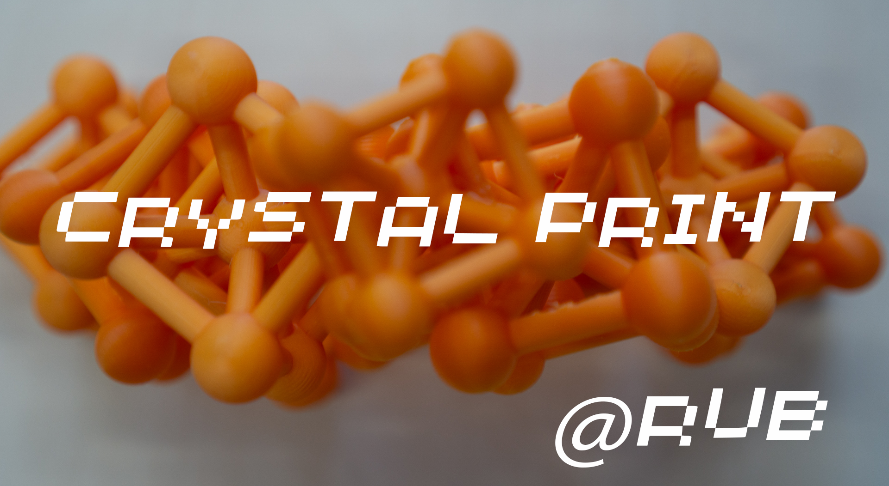
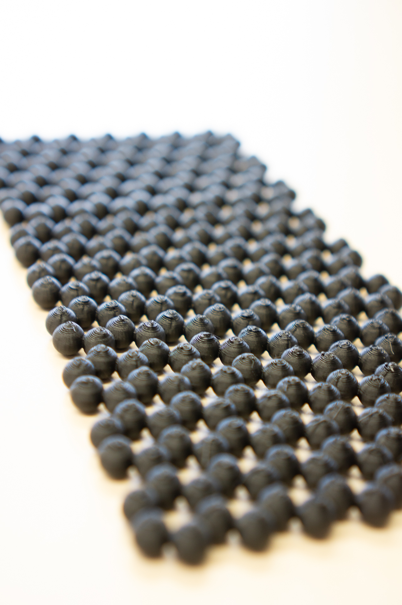
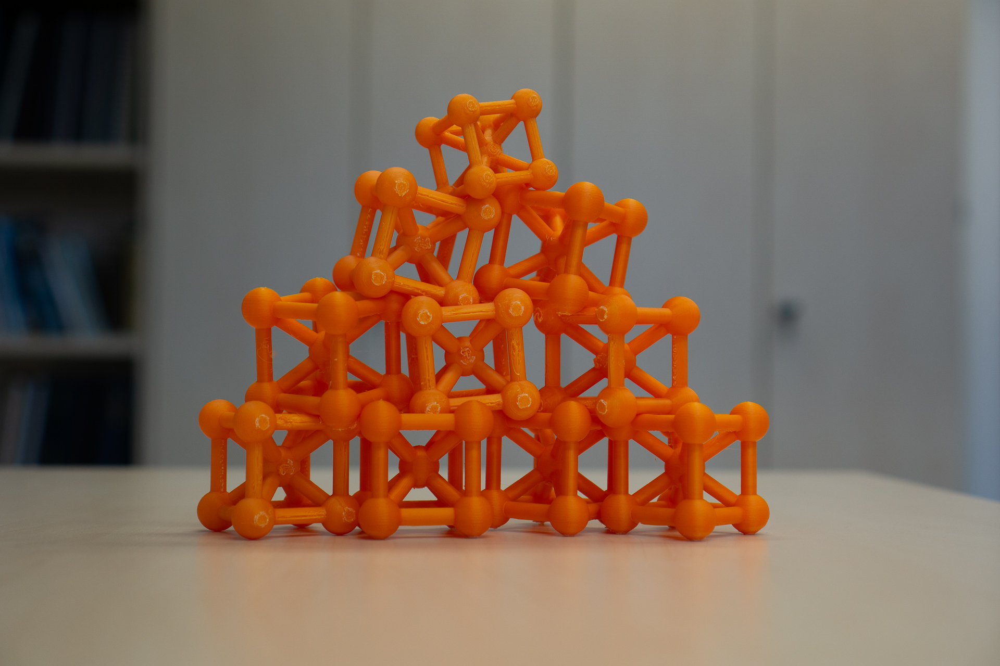
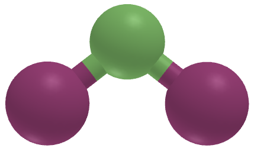
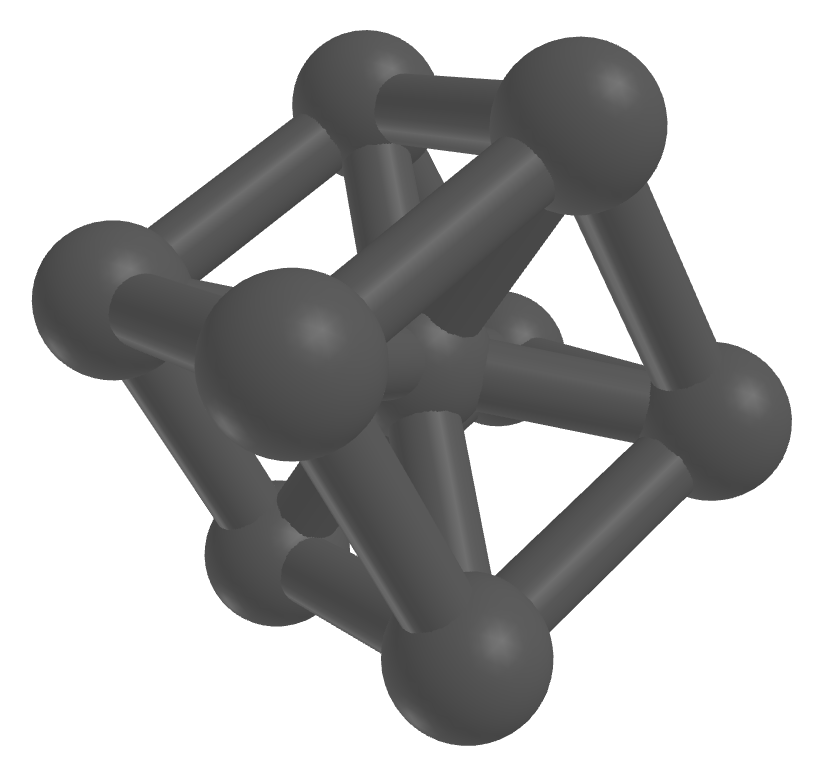

> Follow the repo for pictures of printed structure, many to come !

CrystalPrint is a Python package that converts CIF (Crystallographic Information File) structures into printable 3D objects. It generates a mesh that accurately represents atoms and bonds, ensuring a single manifold without holes or discontinuities. In contrast, software like VESTA often produces output files that may not guarantee this level of integrity.

## Gallery
<div style="display: grid; grid-template-columns: repeat(3, 1fr); gap: 10px;">
    
    
    
</div>

## Project & Team
This repository is part of a project led by *Prof. Miguel Marques* at Ruhr University Bochum, with contributions from *Haichen Wang*, *Théo Cavignon*, *Antoine Loew* and *Pierre-Paul De Breuck*. The project focuses on showcasing a variety of structures, which can be explored in the [Gallery](#gallery) above or `imgs/` directory.


## Features
The tool converts an XYZ file into an STL file, generating a 3D model with the following features:

Spheres are placed at atomic coordinates to represent atoms.
Cylinders are generated as bonds between atoms that are within the distance specified by the `--cutoff` parameter.
A CIF file can also be provided, which will be automatically converted using the unit cell as representation.

## In progress
This package is an early start, much to come:
- Adaptive atomic radii on elements
- fixing scale (2A=1cm)
- Adding color information
- Better bond detection

## Installation

### From PyPI (coming soon)

Once CrystalPrint is available on PyPI, you can install it with:

```bash
pip install crystalprint
```

### From Source

You can also install the package directly from the source by following these steps:

1. Clone the repository:
   ```bash
   git clone https://github.com/ppdebreuck/crystalprint.git
   cd crystalprint
   ```

2. Install the package with:
   ```bash
   pip install .
   ```

## Requirements

- Python 3.x
- numpy
- trimesh
- pymatgen
- pyglet (version < 2)

These dependencies will be automatically installed when you install the package.

## Usage

After installation, you can use CrystalPrint directly from the command line to generate 3D meshes from XYZ or CIF files.

### Command Line Arguments

```bash
usage: crystalprint [-h] [--cutoff BOND_CUTOFF] [--atom_radius ATOM_RADIUS]
                    [--cylinder_diam CYLINDER_DIAM] [--out_dir OUT_DIR]
                    file_path
```

#### Arguments:

- `file_path`: Path to the input XYZ or CIF file.  
- `--bond_cutoff`: Bond cutoff distance (default: 2.9 A).
- `--atom_radius`: Type of atomic radius to use. Choices: `Ionic`, `Covalent`, `Van-der-Waals`, `Crystal`. Default is `Covalent`.
- `--cylinder_diam`: Diameter of the bond cylinder (default: 0.3 A).
- `--out_dir`: Directory to save the output STL files (default: current directory).
- `--color`: Flag to enable colored output.

### Example

To generate a 3D object from a CIF file:

```bash
python -m crystalprint Fe.cif
```
or from XYZ:
```bash
python -m crystalprint C60.xyz
```
or if you want to tune the parameters:
```bash
python -m crystalprint your_structure.cif --cutoff 2.8 --atom_radius Covalent --cylinder_diam 0.4 --out_dir ./output
```

This will generate three STL files:
- `your_structure.stl`: Basic mesh with atoms and bonds.
- `your_structure_repeated_2d.stl`: 2D repeated mesh.
- `your_structure_repeated_3d.stl`: 3D repeated mesh.

You can adjust the bond cutoff, atom radius, and cylinder diameter to match your needs.

### Color

Colored models can be obtained using the `--color` flag. When enabled, a `.obj` file will be created. This feature is still in the testing phase and may produce unexpected results.  




## Example Output

Mesh generated from the conventional Fe CIF file:



## Contributing
This is ongoing work, and any contribution is welcome ! So feel free to fork the repository and submit a pull request, even small ones !

### Issues

If you encounter any issues or have suggestions for improvements, please open an issue in the [GitHub repository](https://github.com/ppdebreuck/crystalprint/issues).

## License

CrystalPrint is licensed under the MIT License. See the [LICENSE](LICENSE) file for more details.

## Author

CrystalPrint is developed by Pierre-Paul De Breuck. You can reach me at [pierre-paul.debreuck@rub.de](mailto:pierre-paul.debreuck@rub.de).


